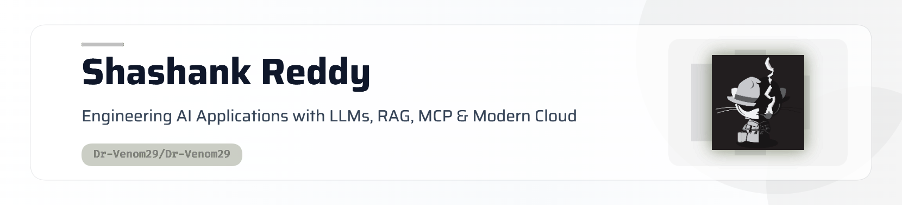

  <picture>
    <source media="(prefers-color-scheme: dark)" srcset="assets/header-dark.png">
    
  </picture>

<h1 align="center">About Me</h1>

  <i>Computer Science & Engineering Student @ KMIT</i> 
  <i>Passionate about <b>AI Engineering</b>, <b>Backend Architecture</b>, & <b>Full-Stack Development</b>.</i>

 

I specialize in building intelligent, scalable applications that bridge the gap between AI research and practical solutions. Here is a quick snapshot of my focus areas:

| Focus Area | Description & Technologies |
| :--- | :--- |
| **AI & LLM Integration** | Building intelligent tools using **Large Language Models**, **Retrieval-Augmented Generation (RAG)**, and agentic workflows. |
| **Backend Engineering** | Designing robust REST APIs and real-time data pipelines using **Python**, **FastAPI**, **Node.js**, and vector databases (**MongoDB**, **ChromaDB**, **FAISS**). |
| **Core Interests** | Document intelligence, contract analysis, API deployment, observability, and AI system reliability. |

   
  <i>Continuously learning, building reliable AI systems, and contributing to impactful engineering projects.</i>

---

## 💻 Tech Stack

---

## 🚀 What I'm Working On

* Building **production-oriented AI applications** with **LLMs**, **RAG**, and **vector databases**
* Developing **scalable backend services** using **Python**, **FastAPI**, **Flask**, and **REST APIs**
* Exploring **AI agents**, **evaluation frameworks**, **observability**, and **reliable AI system design**
* Strengthening my knowledge of **system design**, **distributed systems**, and **software engineering fundamentals**

---

## 📊 GitHub Stats

<!-- Streak — full width -->
<picture>
  <source media="(prefers-color-scheme: dark)" srcset="https://streak-stats.demolab.com/?user=Dr-Venom29&hide_border=true&background=0A101F&stroke=22D3EE&ring=A78BFA&fire=10B981&currStreakLabel=22D3EE&sideLabels=94A3B8&currStreakNum=F8FAFC&sideNums=F8FAFC&dates=64748B&titleColor=22D3EE&card_width=1180" />
  
</picture>

 

<!-- Stats + Top languages — side by side -->
<picture>
  <source media="(prefers-color-scheme: dark)" srcset="https://github-readme-stats-sigma-rosy-28.vercel.app/api?username=Dr-Venom29&show_icons=true&count_private=true&include_all_commits=true&hide_rank=true&hide_border=true&title_color=22D3EE&icon_color=A78BFA&text_color=94A3B8&bg_color=0A101F&card_width=500" />
  
</picture>
<picture>
  <source media="(prefers-color-scheme: dark)" srcset="https://github-readme-stats-sigma-rosy-28.vercel.app/api/top-langs/?username=Dr-Venom29&layout=compact&langs_count=8&hide_border=true&title_color=22D3EE&text_color=94A3B8&bg_color=0A101F&card_width=500" />
  
</picture>

---

## 📈 Contribution Graph

  <picture>
    <source media="(prefers-color-scheme: dark)"
      srcset="https://raw.githubusercontent.com/Dr-Venom29/Dr-Venom29/output/github-snake-dark.svg" />
    <source media="(prefers-color-scheme: light)"
      srcset="https://raw.githubusercontent.com/Dr-Venom29/Dr-Venom29/output/github-snake.svg" />
    
  </picture>

---

## 📊 GitHub Summary

---

## 🌐 Socials

&nbsp;&nbsp;

